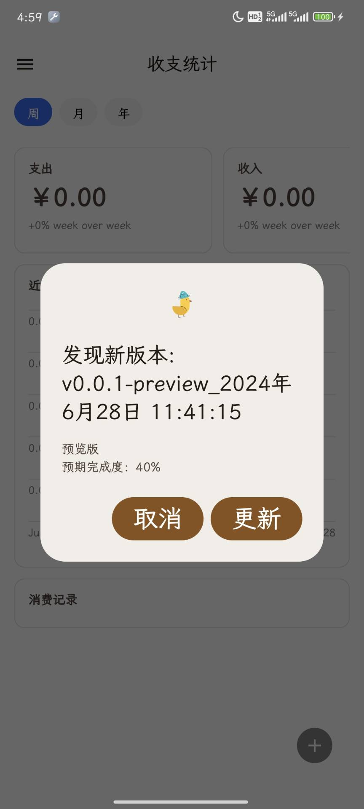
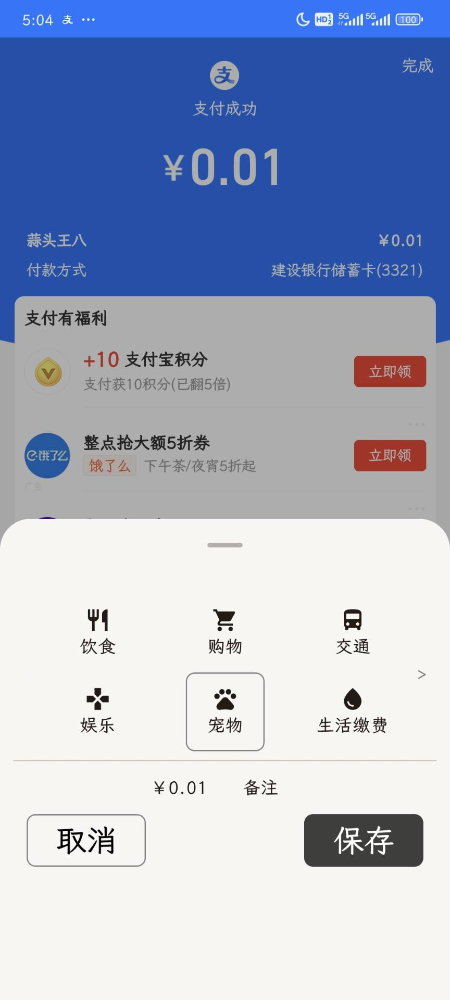
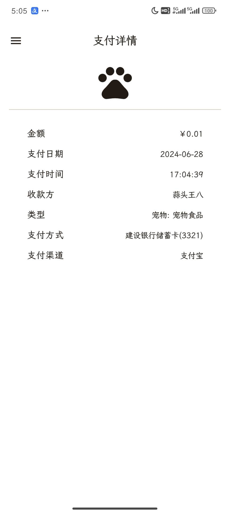
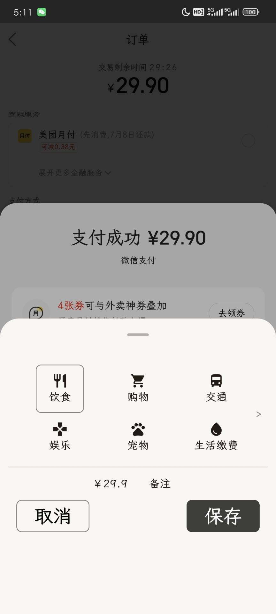
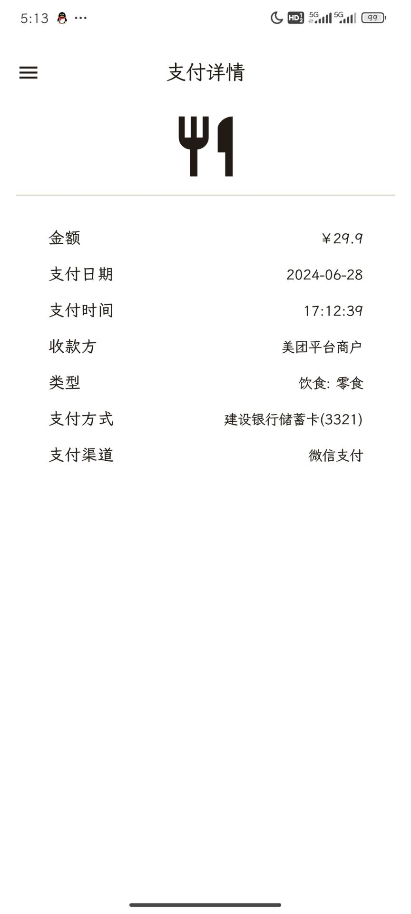
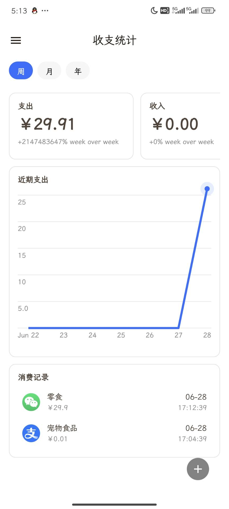
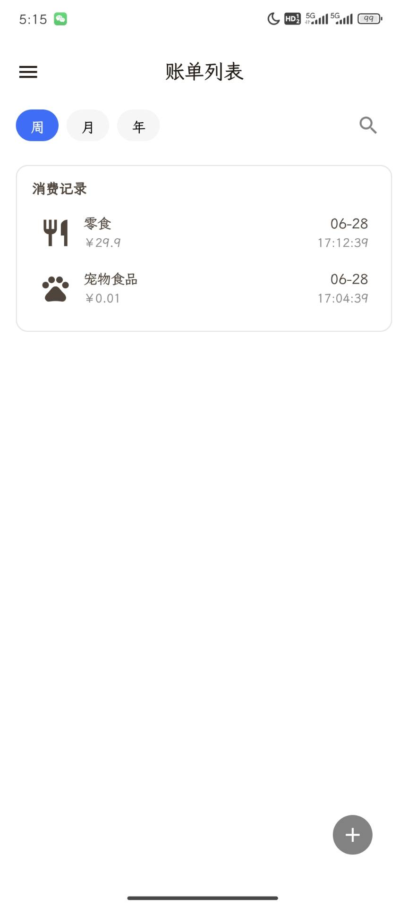
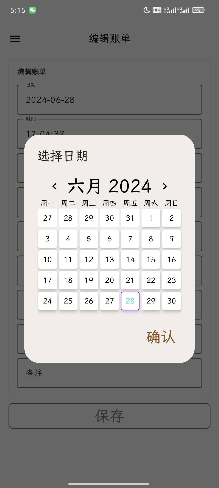

    

        
    

    <h1>🤪Blenh (Android)</h1>
    

        
        
        
        
    

    

        <b>Blenh</b>，记录你的支付行为
    

## ✨功能

1. 通过无障碍捕获**微信支付**、**支付宝**的支付事件
2. ...

## 🖼截图

## 👀更新计划

1. Github Action 打包工作流
2. APP内自动下载更新，替换目前的跳转浏览器下载
3. 自建分类（Category）及下级类型（Type）
4. 数据分析页
5. 自选主题
6. 性能测试及优化
7. i18n
8. ..

## 📃 License

This software code is available under the following **license**

[**GNU General Public License v3.0**](LICENSE)

## 😍开源项目

在这些开源项目中学到了许多

* [Rays-Android](https://github.com/SkyD666/Rays-Android)

* [boguszpawlowski](https://github.com/boguszpawlowski/ComposeCalendar)